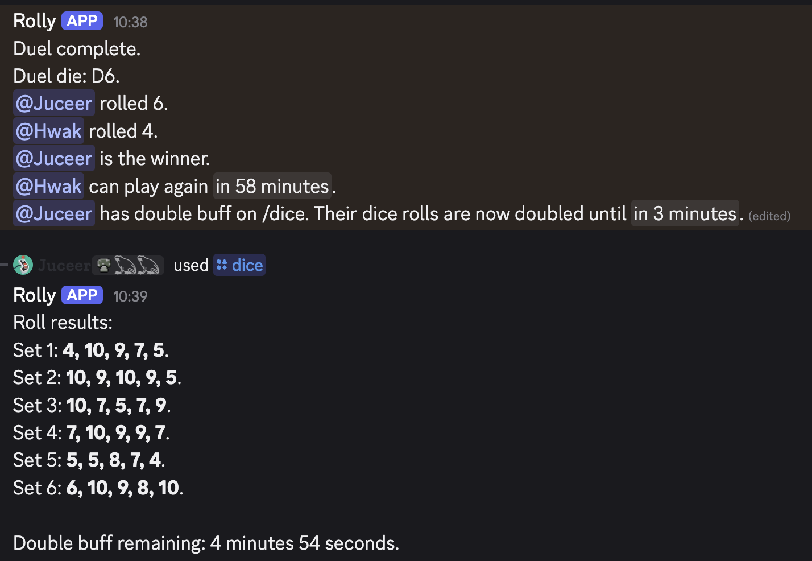
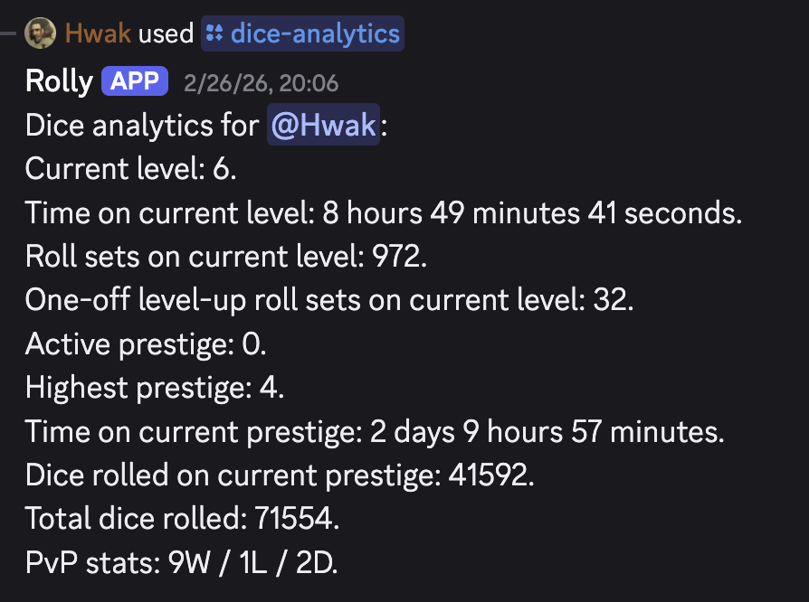
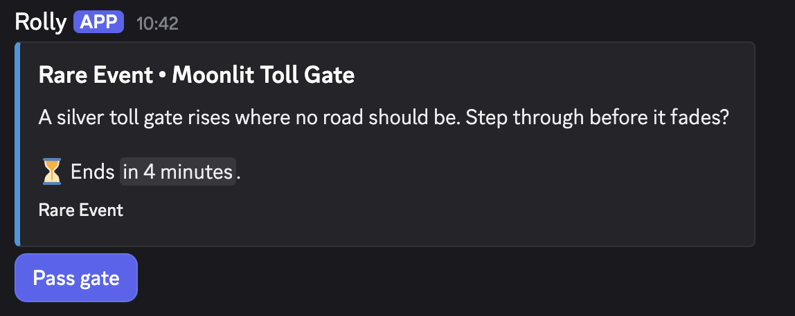

# Rolly

Discord bot focused on rolling dice. The project is mostly written by AI but reviewed by a human.

## What Rolly Is

Rolly is a Discord dice game built around repeated rolls, progression, and small moments of luck. Players roll their current dice set trying to hit matching combinations, unlock achievements, gain Fame, configure bans, prestige into stronger dice, challenge others in duels and so on.

## Screenshots

PvP duels can grant temporary roll buffs that feed back into the main `/dice` loop:



Players can also inspect long-term progression with `/dice-analytics`:



Random events appear as live interaction prompts in the server:



And much more!

## Requirements

- Node.js 24.13.0 (see `.nvmrc`)

## Quick Start

```bash
nvm use
npm install
cp .env.example .env
# Optional but recommended for real gameplay data.
# Without private data, startup stays fail-closed unless
# ROLLY_ALLOW_EXAMPLE_DATA=true is set intentionally.
# git clone <your-private-rolly-data-url> ./rolly-data
npm run build
npm run deploy:commands
npm start
```

## Environment Variables

Rolly reads configuration from `.env`. The source of truth for available variables is [.env.example](/Users/tero/workspace/rolly/.env.example).

### Required

- `DISCORD_TOKEN`: Bot token from the Discord Developer Portal.
- `DISCORD_CLIENT_ID`: Application ID for the Discord bot.
- `DISCORD_OWNER_ID`: Your Discord user ID. Required for owner-only commands such as `/self-update` and `/dice-admin`.

### Optional

- `DISCORD_GUILD_ID`: Development guild/server ID for fast slash-command iteration. If omitted, commands are deployed globally.
- `ROLLY_DATA_DIR`: Absolute or repo-relative path to your private `rolly-data` checkout. If omitted, the app tries `./rolly-data` and only falls back to `./example-data/rolly-data` when `ROLLY_ALLOW_EXAMPLE_DATA=true`.
- `ROLLY_ALLOW_EXAMPLE_DATA`: Development-only flag. Set to `true` only if you intentionally want to run against the public example data. Default: disabled.
- `RANDOM_EVENTS_CHANNEL_ID`: Channel ID where random events are posted. If random events are enabled but this is unset, no event messages can be posted.
- `RANDOM_EVENTS_ENABLED`: Enables or disables the random-event scheduler. Default: `true`.
- `RANDOM_EVENTS_TARGET_PER_DAY`: Target number of random events per day. Default: `10`.
- `RANDOM_EVENTS_MIN_GAP_MINUTES`: Minimum time between random-event opportunities. Units: minutes. Default: `45`.
- `RANDOM_EVENTS_MAX_ACTIVE`: Maximum number of active random events at once. Default: `1`.
- `RANDOM_EVENTS_RETRY_DELAY_SECONDS`: Retry delay after a failed or skipped trigger. Units: seconds. Default: `300`.
- `RANDOM_EVENTS_JITTER_RATIO`: Random scheduling jitter ratio used by the scheduler. Default: `0.35`.
- `RANDOM_EVENTS_QUIET_HOURS_START`: Quiet-hours start time in `HH:MM` 24-hour format. Default: `23:00`.
- `RANDOM_EVENTS_QUIET_HOURS_END`: Quiet-hours end time in `HH:MM` 24-hour format. Default: `08:00`.
- `RANDOM_EVENTS_QUIET_HOURS_TIMEZONE`: IANA timezone used for quiet hours. Default: `Europe/Helsinki`.

Use placeholder values in `.env.example`, keep your real `.env` private, and do not commit real tokens or IDs you consider sensitive.

Example:

```bash
DISCORD_TOKEN=your_bot_token
DISCORD_CLIENT_ID=your_application_id
DISCORD_GUILD_ID=your_dev_server_id
DISCORD_OWNER_ID=your_discord_user_id
RANDOM_EVENTS_CHANNEL_ID=channel_for_random_events
```

## Data Storage

The bot stores game data in `./data/rolly-bot.sqlite`.

## Game Data

Rolly keeps the real spoilery game data outside the public app repository.

- Public repo: `rolly-bot`
- Private companion repo: `rolly-data`

At startup, the bot loads gameplay data in this order:

1. `ROLLY_DATA_DIR`
2. `./rolly-data`
3. `./example-data/rolly-data` only when `ROLLY_ALLOW_EXAMPLE_DATA=true`

Expected files in a data directory:

- `achievements.json`
- `dice-balance.json`
- `random-events.v1.json`

The committed files under `example-data/rolly-data` are safe examples only. They document the schema and can keep the public repo runnable when explicitly enabled, but they are not intended to match production values.

By default, the app refuses to start on `example-data`. If you intentionally want to run the public sample data for local development, set `ROLLY_ALLOW_EXAMPLE_DATA=true`.

Recommended setup for a real deployment:

```bash
git clone https://github.com/tero-laanti/rolly-bot.git
cd rolly-bot
git clone <your-private-rolly-data-url> ./rolly-data
cp .env.example .env
```

If `./rolly-data` or `ROLLY_DATA_DIR` points to a git checkout, `/self-update` will pull that repo too before rebuilding.

## Commands

- `/dice` rolls your current dice set, handles level-ups, rewards, charge rolls, temporary effects, and achievements.
- `/dice-prestige` manages prestige progression and active prestige selection.
- `/dice-shop` lets players spend Pips on shop items and build an inventory.
- `/dice-inventory` shows owned items and lets players use them.
- `/dice-bans` configures banned values on your current dice setup.
- `/dice-pvp` creates and resolves PvP dice duels.
- `/dice-achievements` lists unlocked dice achievements.
- `/dice-analytics` shows progression and PvP stats.
- `/dice-admin` exposes owner-only dice admin tools, including random-event status and effect cleanup. It is Discord admin-gated and guild-only so regular users should not see it in the command picker.
- `/self-update` pulls the latest code, optionally runs `npm install`, refreshes `rolly-data` when configured as a git checkout, rebuilds, and redeploys commands. It is Discord admin-gated and guild-only so regular users should not see it in the command picker.

## Project Layout

- `src/commands/dice/` contains Discord command adapters for the dice product.
- `src/commands/system/self-update.ts` contains the owner-only system update command.
- `src/dice/core/application/` contains the core dice use-case orchestration such as roll, prestige, bans, PvP, and admin flows.
- `src/dice/core/domain/` contains focused dice modules for balance, prestige, bans, analytics, charge, PvP, achievements, and temporary effects.
- `src/dice/core/presentation/` contains dice-specific output formatting for Discord messages and components.
- `src/dice/features/` is where larger dice features live as they grow beyond the core loop.
- `src/dice/features/random-events/` contains the random-event scheduler, runtime, state, content selection, and admin wiring.
- `src/shared/` contains shared infrastructure such as db, config, env, economy, and self-update helpers.
- `src/rolly-data/` is the boundary for hidden gameplay data loading and validation.
- `src/bot/` contains the Discord runtime wiring. `src/index.ts` and `src/deploy-commands.ts` stay as thin entry wrappers so npm scripts remain stable.

## Development

```bash
npm run dev
npm run lint
npm run format
npm run format:check
```

`dist/` is generated by `npm run build`. Do not edit generated files directly.

When you add or change environment variables or the `rolly-data` file contract, update `.env.example`, `README.md`, and `example-data/rolly-data` in the same change.
