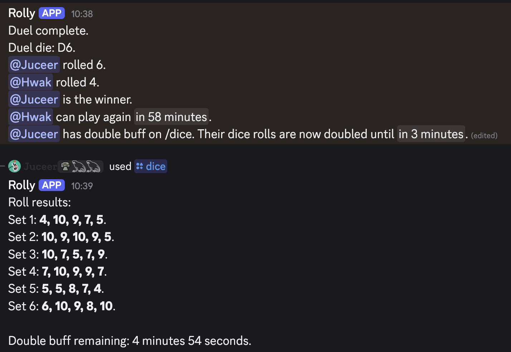
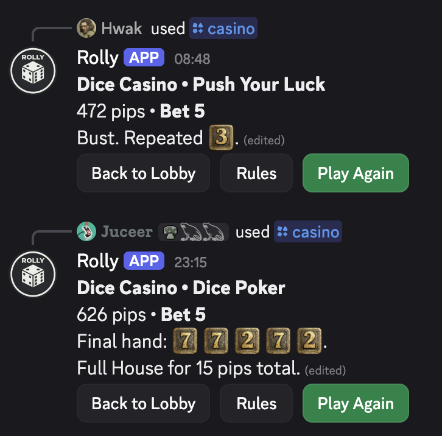
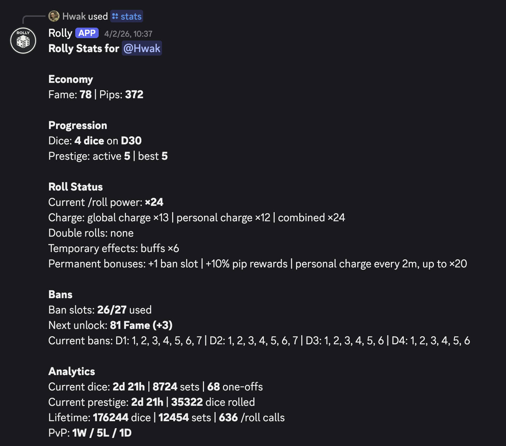
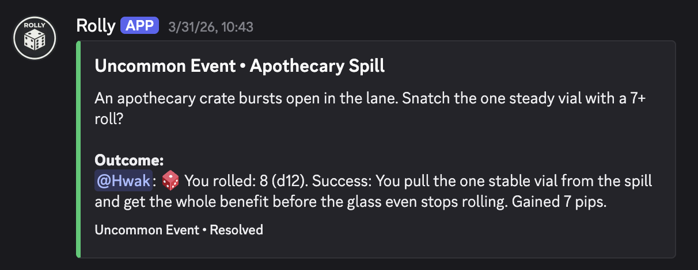
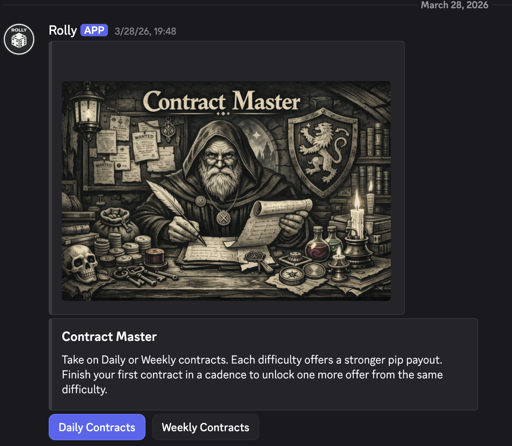
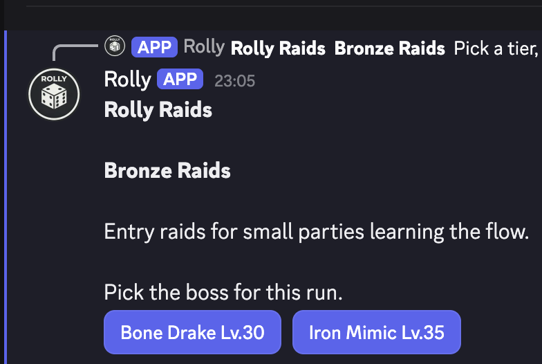
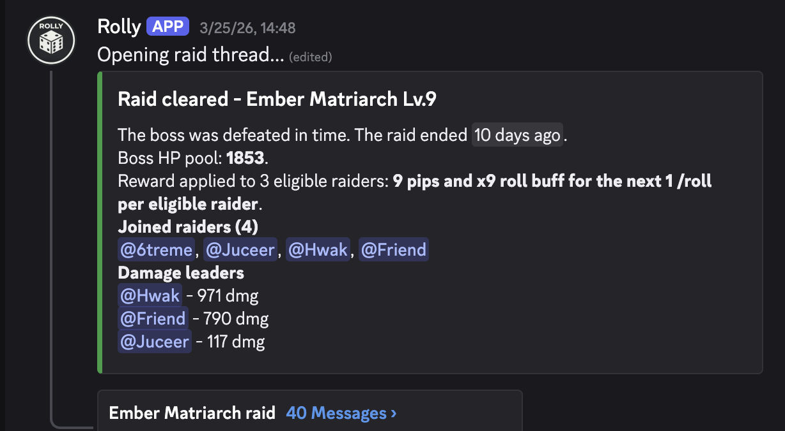

# Rolly

Rolly is a Discord dice game bot built around a persistent loop: roll, grow your dice, prestige, pick up items, duel other players, and react to live server events without leaving Discord.

## Why Rolly

- `/roll` is the core loop: matching rolls drive progression, achievements, Fame, Pips, bans, and temporary effects.
- The surrounding systems keep the server busy: PvP, casino games, contracts, player-started raids, World Boss fights, post-clear Double Roll Rush threads, random events, inventory, and progression systems all feed back into the next roll, including random-event payouts that can grant consumable items.

## In Action

PvP duels can grant temporary roll buffs that feed back into the main `/roll` loop:



Casino serves as a nice place to spend time:



Players can inspect their current Rolly status with `/stats`:



Random events arrive as live interaction prompts inside the server:



Contracts use a persistent Contract Master panel with Daily and Weekly offers:



Player-started raids begin from synced tier panels instead of a slash command:



Successful raids resolve in Discord with rewards, participants, and damage leaders:



## Command Surface

- Player commands: `/roll`, `/balance`, `/leaderboards`, `/prestige`, `/bans`, `/casino`, `/shop`, `/inventory`, `/pvp`, `/achievements`, `/contracts`, and `/stats`
- Owner/admin commands: `/admin` and `/self-update`
- Startup-synced panel surfaces: Contract Master and the player-started raid tier panels. Raids do not use a `/raids` slash command.

## Quick Start

Requirements:

- Node.js `24.14.0` (see [.nvmrc](.nvmrc))

Local setup:

```bash
nvm use
npm install
cp .env.example .env
# fill in DISCORD_TOKEN and DISCORD_OWNER_ID
# set DISCORD_CLIENT_ID before npm run deploy:commands
# set DISCORD_GUILD_ID for faster local iteration
npm run deploy:commands
npm run dev
```

If you have a private `rolly-data` checkout, place it in `./rolly-data` or point `ROLLY_DATA_DIR` at it. Otherwise Rolly falls back to the public examples in [example-data/rolly-data/](example-data/rolly-data/). See [docs/development.md](docs/development.md) for more information.

Gameplay content, panel wiring, and validation details live in [docs/development.md](docs/development.md) and [example-data/rolly-data/](example-data/rolly-data/).
Achievement data can also carry optional Discord role reward metadata, and raid tiers can optionally grant Discord roles plus authored unlock copy on first clears.

## Further Reading

- [docs/development.md](docs/development.md) for local setup, validation, and day-to-day workflow
- [docs/architecture.md](docs/architecture.md) for the high-level codemap, boundaries, and invariants
- [example-data/rolly-data/README.md](example-data/rolly-data/README.md) for the public gameplay-data layout
- [example-data/rolly-data/AUTHORING.md](example-data/rolly-data/AUTHORING.md) for data authoring notes
- [AGENTS.md](AGENTS.md) for repo-specific contributor guardrails
