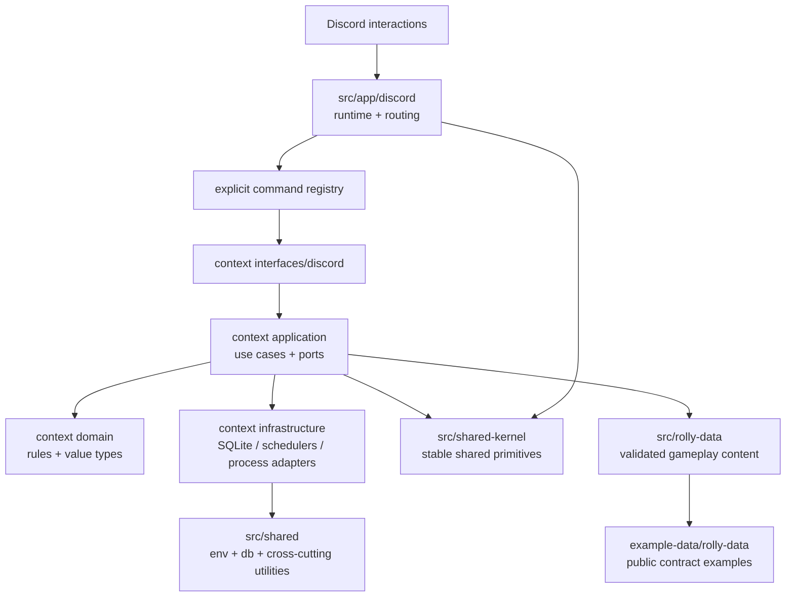
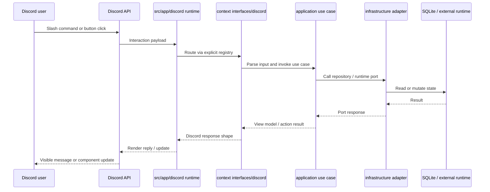
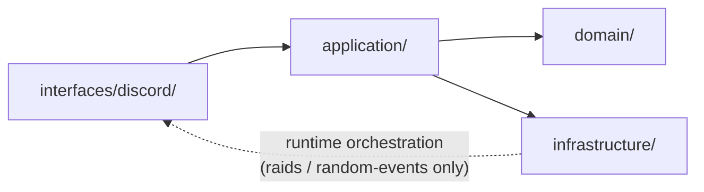

# Architecture

Read [README.md](../README.md) first for the product overview and [development.md](development.md) for local setup. This document is the stable map of the codebase: it explains where major responsibilities live and which boundaries define the project structure.

## Bird's-Eye View

Rolly is a Discord-first modular monolith. Discord interactions enter through the shared app runtime, get routed to context-owned command adapters, and then flow into context application use cases and domain rules. Concrete adapters handle SQLite, Discord I/O, schedulers, and process execution. Gameplay content is loaded from `rolly-data`, which lets balance and authored content evolve without changing the bot runtime every time.

## Visual Map

The diagrams below are intentionally structural, not exhaustive. They show the stable paths and boundaries that matter when navigating or extending the codebase.

### System overview

### Typical interaction flow

## Codemap

### Boot and composition

- [src/index.ts](../src/index.ts) starts the bot runtime. Use symbol search for `startDiscordBot` when you want the real startup path.
- [src/deploy-commands.ts](../src/deploy-commands.ts) starts slash-command deployment. Use symbol search for `deployDiscordCommands` when tracing command registration.
- [src/app/bootstrap/](../src/app/bootstrap/) is the composition root for those two entry flows.

### Discord runtime

- [src/app/discord/](../src/app/discord/) owns the Discord client runtime, interaction routing, shared renderers, and the explicit command registry.
- Search for `discordCommands` and `discordButtonHandlers` when you need to answer "which commands or button flows are live?"
- Search for `ActionView`, `ActionResult`, `renderActionResult`, and `renderActionButtonRows` when you need the shared shape for button-driven interaction responses.

### Gameplay contexts

- [src/dice/](../src/dice/) is organized by game context, not by technical layer. If a change belongs to progression, economy, inventory, PvP, raids, or random events, start in that owning context.
- Most command-driven contexts use the same split:
  `domain/` for rules and value types,
  `application/` for use cases and ports,
  `infrastructure/` for SQLite and other concrete adapters,
  `interfaces/discord/` for slash commands, button ids, and presenters.
- `random-events` and `raids` are intentionally different. Their [src/dice/random-events/infrastructure/](../src/dice/random-events/infrastructure/) and [src/dice/raids/infrastructure/](../src/dice/raids/infrastructure/) folders own live runtimes, schedulers, admin control, and Discord orchestration. Their `interfaces/discord/` folders stay narrow and mostly handle button ids, prompts, and interaction helpers.
- Search for `DiceEconomyRepository` or other context `ports.ts` symbols when you need the application-facing repository contracts.

#### Context shape

Runtime orchestration includes the scheduler, live runtime, admin control, and Discord orchestration that `random-events` and `raids` keep in `infrastructure/`.

### Shared systems

- [src/system/self-update/](../src/system/self-update/) is the owner-only operational subsystem. Search for `createRunSelfUpdateUseCase` when you want the update flow.
- [src/shared-kernel/](../src/shared-kernel/) contains small, stable architecture primitives shared across contexts.
- [src/shared/](../src/shared/) contains shared infrastructure such as env loading, database helpers, and cross-cutting utilities.
- [src/rolly-data/](../src/rolly-data/) loads and validates authored gameplay data. Search for `primeRollyData`, `getRollyData`, and `resolveRollyDataSource` when you need the data-loading path.

## Where to Change X

- New slash command or button flow: start in the owning context under `interfaces/discord/`, then register it explicitly through the shared command registry in [src/app/discord/](../src/app/discord/).
- Gameplay rules, value objects, or balance-sensitive logic: start in the owning context `domain/` or `application/` layer.
- SQLite-backed persistence: use the owning context `infrastructure/` layer and prefer its `infrastructure/sqlite/services.ts` builder when that pattern exists.
- Random-event or raid scheduling, lifecycle management, or live Discord orchestration: work in the corresponding `infrastructure/` folder for that context.
- Shared interaction rendering: use [src/shared-kernel/](../src/shared-kernel/) plus the renderers in [src/app/discord/](../src/app/discord/).
- Gameplay data contracts or authored content loading: use [src/rolly-data/](../src/rolly-data/) and the public examples in [example-data/rolly-data/](../example-data/rolly-data/).

## Architectural Invariants

- `application/` and `domain/` code should stay free of Discord runtime imports and concrete infrastructure dependencies. Adapters belong in `infrastructure/`, `interfaces/discord/`, or `src/app/`.
- Slash commands and button handlers are registered explicitly rather than discovered from the filesystem.
- For SQLite-backed command flows, prefer context `infrastructure/sqlite/services.ts` builders at the interface edge. New application code should depend on ports and `UnitOfWork`, not direct `shared/db` imports.
- `random-events` and `raids` keep long-lived runtimes and scheduler orchestration in `infrastructure/`. Their `interfaces/discord/` folders should stay presentation- and identifier-oriented.
- Real gameplay content and tuning live outside the public app repo. The files in [example-data/rolly-data/](../example-data/rolly-data/) are public examples and contract documentation, not the private balance or spoiler-heavy content used in a private `rolly-data` checkout.
- `dist/` is generated output. Source-of-truth code lives under `src/`.

## Cross-Cutting Concerns

- Persistence: shared SQLite primitives live in [src/shared/db/](../src/shared/db/), while context repositories translate storage details into application ports.
- Authored gameplay data: [src/rolly-data/](../src/rolly-data/) validates the external JSON contract before the rest of the bot uses it.
- Interaction rendering: button-based flows converge on `ActionView` and `ActionResult`, then render through the shared Discord helpers.
- Operations and live control: owner-only update logic lives in [src/system/self-update/](../src/system/self-update/), while live game admin flows live in [src/dice/admin/](../src/dice/admin/).
